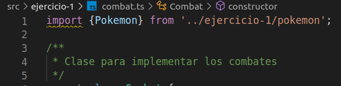

# Práctica 4: Arrays, tuplas y enumerados. Informe.
## Desarrollo de Sistemas Informáticos 
## Raúl Martín Rigor - alu0101203003@ull.edu.es

### Introducción

En este informe se resumen las actividades realizadas en la **práctica 5** para poner en práctica nuestros conocimientos de TypeScript sobre tipos de datos que son utilizados para agrupar elementos (arrays, tuplas y enumerados) a través de la implementación de distintas funciones en una serie de ejercicios.

### Objetivos

Al finalizar la práctica, habremos completado los siguientes objetivos:

* Separar las clases de un mismo cógdigo en ficheros
* Crear y manipular con soltura clases y sus respectivos atributos
* Crear interfaces implementables en nuestras clases
* Manejo de instancias, constructores y constructores simplificados
* Crear espectativas que incluyan `console.table()` para mostrar nuestros resultados en forma de tabla

### 1. Creación y configuración del driectorio del proyecto.

#### 1.1. Estructura inicial

Para la creación de la estructura inicial, seguiremos los mismos pasos que en practicas anteriores ([práctica 4](https://github.com/ULL-ESIT-INF-DSI-2021/ull-esit-inf-dsi-20-21-prct04-arrays-tuples-enums-alu0101203003/blob/gh-pages/index.md)).

La estructura debería quedar similar a las siguientes fotos:

  

#### 1.2. Organización de los ejercicios

Será necesario implementar las clases de cada ejercicio en ficheros diferentes. Las clases que dependan de otras requeriran de un `import` de la clase que necesiten:

 
