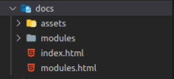

# Práctica 5: Objetos, clases e interfaces. Informe.
## Desarrollo de Sistemas Informáticos 
## Raúl Martín Rigor - alu0101203003@ull.edu.es

### Introducción

En este informe se resumen las actividades realizadas en la **práctica 5** para poner en práctica nuestros conocimientos de TypeScript sobre tipos de datos que son utilizados para agrupar elementos (arrays, tuplas y enumerados) a través de la implementación de distintas funciones en una serie de ejercicios.

### Objetivos

Al finalizar la práctica, habremos completado los siguientes objetivos:

* Separar las clases de un mismo cógdigo en ficheros
* Crear y manipular con soltura clases y sus respectivos atributos
* Crear interfaces implementables en nuestras clases
* Manejo de instancias, constructores y constructores simplificados
* Crear espectativas que incluyan `console.table()` para mostrar nuestros resultados en forma de tabla

### 1. Creación y configuración del driectorio del proyecto.

#### 1.1. Estructura inicial

Para la creación de la estructura inicial, seguiremos los mismos pasos que en practicas anteriores ([práctica 4](https://github.com/ULL-ESIT-INF-DSI-2021/ull-esit-inf-dsi-20-21-prct04-arrays-tuples-enums-alu0101203003/blob/gh-pages/index.md)).

La estructura debería quedar similar a las siguientes fotos:

  

#### 1.2. Organización de los ejercicios

Será necesario implementar las clases de cada ejercicio en ficheros diferentes. Las clases que dependan de otras requeriran de un `import` de la clase que necesiten:

 

### 2. Ejercicios

Paso a explicar la resolución de cada ejercicio y a adjuntar su código y expectativa. Se mostrará una versión simplificada de los enunciados de los ejercicios (para verlos al completo con aclaraciones y pistas, consultar la [guía de la práctica](https://ull-esit-inf-dsi-2021.github.io/prct05-objects-classes-interfaces/).

(Para poder acceder a los atributos privados que creemos en las clases usaremos funciones *set* y *get*, las cuales se pueden encontrar en el código fuente.)

#### 2.1 Ejercicio 1

**Enunciado:**
A partir del Ejercicio 9 realizado en la Práctica 3, cree la estructura de clases e interfaces que considere oportuna para representar el siguiente escenario.

Se pide crear una Pokedex donde se almacene la información relacionada con distintos Pokemons. Para cada Pokemon, se deben almacenar los siguientes elementos de información en la Pokedex:

* Nombre del Pokemon
* Peso y altura
* Tipo
* Estadísticas básicas: ataque, defensa, velocidad, daño máximo (HP). Puede encontrar información relativa aquí.

Por último, diseñe una clase Combat que simule el combate entre dos Pokemons. Para ello, un objeto de dicha clase deberá ser construido con dos contrincantes. Además, reescriba la función del ejercicio 9 de la práctica 3 como un método de esta clase. Incluya también un método start dentro de la clase Combat que realice la simulación del combate. Este método se basará en lo siguiente:

* Se realizarán ataques entre los contrincantes hasta que el daño sufrido por uno de ellos sea igual o superior a su HP.
* Se considera que el primero de los contrincantes que recibe un objeto de la clase Combat será siempre el primero en realizar un ataque.
* El método deberá mostrar por pantalla la evolución del combate. Esto es, después de cada ataque se debe mostrar el estado de HP de cada contrincante.

**Resolución:**

La clase pokemon almacena la informacion de cada pokemon y se construye de la siguiente manera:

```ts
private EstadisticasBasicas = {
        ataque : 0,
        defensa : 0,
        velocidad :0,
        hp : 0,
    }

    /**
     * Constructor
     * @param nombre nombre del pokemon
     * @param peso peso del pokemon
     * @param altura altura del pokemon
     * @param tipo tipo del pokemon
     * @param estadisticas estadisticas asignables al atributo "EstadisticasBasicas" del pokemon
     */
    constructor (private nombre :string, private peso :number, private altura :number, private tipo :string, estadisticas :number[]){
        this.EstadisticasBasicas.ataque = estadisticas[0];
        this.EstadisticasBasicas.defensa = estadisticas[1];
        this.EstadisticasBasicas.velocidad = estadisticas[2];
        this.EstadisticasBasicas.hp = estadisticas[3];
    }
```

La clase pokedex almacena todos los pokemons y se construye de la siguiente manera:

```ts
   /**
    * Constructor
    * @param pokemons conjunto de pokemons
    */
   constructor(private pokemons :Pokemon[]){}
```

La clase combat nos servirá para implementar los combates y obtener información de ellos:


```ts
  /**
   * Constructor
   * @param pokemon1 pokemon que ataca primero
   * @param pokemon2 pokemon que ataca segundo
   */
  constructor (private pokemon1 :Pokemon, private pokemon2 :Pokemon){
    }
```

La función principal es start, ya que con ella empezamos los combates. Start se encargará de usar el daño de los ataques entre los pokemons rivales para restar puntos de vida al pokemon que recibe el ataque.

Cuando algún pokemon se quede a 0 de vida, se parará el combate y se proclamará vencedor el pokemon que quede con vida:


```ts
    /**
     * Funcion start
     * Inicia el combate e inidica las variaciones de las vidas de los pokemons enfrentados con cada ataque
     * @returns mensaje inidicando que pokemon resulta vencedor
     */
       public start(){

        while (this.pokemon1.getEstadisticas().hp > 0 && this.pokemon2.getEstadisticas().hp > 0){
            var ataque1 :(number|string) = this.pokemonDamage(1)
            var ataque2 :(number|string) = this.pokemonDamage(2)
            if (typeof ataque1 === "number" && typeof ataque2 === "number"){
                ataque1 = Math.round(ataque1);
                ataque2 = Math.round(ataque2);

            var vidaNueva2 : number = this.pokemon2.getEstadisticas().hp - ataque1;
            if (vidaNueva2 < 0){
                vidaNueva2 = 0;
            }
            this.pokemon2.setHp(vidaNueva2)
            console.log(this.pokemon1.getNombre(),"ha hecho",ataque1, "puntos de daño")
            console.log("A",this.pokemon2.getNombre(),"le quedan",this.pokemon2.getEstadisticas().hp,"puntos de vida")
            if (this.pokemon2.getEstadisticas().hp == 0){
                break;
            }

            var vidaNueva1 : number = this.pokemon1.getEstadisticas().hp - ataque2;
            if (vidaNueva1 < 0){
                vidaNueva1 = 0;
            }
            this.pokemon1.setHp(vidaNueva1)
            console.log(this.pokemon2.getNombre(),"ha hecho",ataque2, "puntos de daño")
            console.log("A",this.pokemon1.getNombre(),"le quedan",this.pokemon1.getEstadisticas().hp,"puntos de vida")
            if (this.pokemon1.getEstadisticas().hp == 0){
                break;
            }

            } else {
                return "Error: Tipo de algún pokemon mal especificado"
            }
        }

        if (this.pokemon1.getEstadisticas().hp <= 0){
            return ('\n' + this.pokemon2.getNombre() + ' ha vencido')
        } else{
            return ('\n' + this.pokemon1.getNombre() + ' ha vencido')
        }
    }
```

Como podemos comprobar, start necesita de la función pokemonDamage, la cual se encargará de calcular el daño provocado por cada ataque en funcion de la efectividad de tipo para cada turno del combate:

```ts
    /**
     * Funcion pokemonDamage
     * @param atacante pokemon que tiene el turno para atacar (1 o 2)
     * @returns daño realizado por el pokemon que ataca
     */
    public pokemonDamage(atacante :number){
        var tipo1 = this.pokemon1.getTipo();
        var tipo2 = this.pokemon2.getTipo();
        var at1 = this.pokemon1.getEstadisticas().ataque
        var df1 = this.pokemon1.getEstadisticas().defensa
        var at2 = this.pokemon2.getEstadisticas().ataque
        var df2 = this.pokemon2.getEstadisticas().defensa

        var efectividad1 :number = 0.0;
        var efectividad2 :number = 0.0;
    
        switch (true) {
            case tipo1 == "fuego" && tipo2 =="hierba":
            case tipo1 == "agua" && tipo2 =="fuego":
            case tipo1 == "hierba" && tipo2 =="agua":
            case tipo1 == "electrico" && tipo2 =="agua":
                efectividad1 = 2.0;
                efectividad2 = 0.5;
                break;
            case tipo1 == "fuego" && tipo2 =="electrico":
            case tipo1 == "electrico" && tipo2 =="fuego":
            case tipo1 == "hierba" && tipo2 =="electrico":
            case tipo1 == "electrico" && tipo2 =="hierba":
                efectividad1 = 1.0;
                efectividad2 = 1.0;
                break;
            case tipo1 == tipo2:
            case tipo1 == "hierba" && tipo2 =="fuego":
            case tipo1 == "fuego" && tipo2 =="agua":
            case tipo1 == "agua" && tipo2 =="hierba":
            case tipo1 == "hierba" && tipo2 =="fuego":
                efectividad1 = 0.5;
                efectividad2 = 2.0;
                break;
            default:
                break;
        }

        if (efectividad1 == 0 || efectividad2 == 0){
            return ("Error: Tipo mal especificado")
        }

        var damage :number = 0
        if (atacante == 1){
        damage = 50 * (at1/df2) * efectividad1;
        }
        if (atacante == 2){
        damage = 50 * (at2/df1) * efectividad2;
        }
        return damage;
    }
```


#### 2.2 Ejercicio 2

**Enunciado:**
Los gestores bibliográficos son herramientas que permiten almacenar, consultar y exportar artículos de investigación. Estos gestores permiten filtrar el contenido de su base de datos por los valores de los campos que tienen los artículos de investigación. Principalmente, los campos más importantes para el filtrado son las palabras clave, autores, fecha de publicación y editorial, entre otros.

A partir de esta premisa, diseñe el conjunto de clases e interfaces que considere para representar un gestor bibliográfico. El desarrollo realizado debe tener las siguientes funcionalidades:

Para cada artículo de investigación habrá que almacenar:
* Título
* Autor o autores del artículo.
* Email de cada uno de los autores.
* Palabras claves o keywords.
* Resumen o abstract del artículo.
* Fecha de publicación.
* Editorial en la que se publicó el artículo.
* Número de citas: cantidad de veces que el artículo ha sido referenciado en otros trabajos.
* Además, incluya un método que devuelva la referencia del artículo en formato APA

El gestor bibliográfico deberá:

* Almacenar la información de múltiples artículos.
* Mostrar por la consola la información incluida en la base de datos en formato tabla (console.table).
* Permitir llevar a cabo búsquedas de trabajos por palabras claves y mostrar los resultados de la búsqueda en formato de tabla. Además, se deberá poder filtrar por los campos fecha de publicación, editorial y nombre de autor.
* Permitir la exportación de los resultados de una búsqueda en formato de cita APA.

**Resolución:**

La clase articulo contiene todas las propiedades de un articulo. Se construye de la siguiente manera:

```ts
    /**
     * Constructor
     * @param titulo titulo del articulo
     * @param autor autor / autores del articulo
     * @param email email del autor / autores
     * @param keywords palabras clave del articulo
     * @param resumen resumen o abstract del articulo
     * @param fecha fecha de publicación del articulo
     * @param editorial editorial en la que se publicó el articulo
     * @param numCitas cantidad de veces que el articulo ha sido referenciado en otros trabajos
     */
    constructor(private titulo: string, private autor: string[], private email: string[], private keywords: string[], private resumen: string, private fecha: number,private editorial: string, private numCitas: number) {
    }
```

La clase articulo tiene un método que permite cambiar el formato del articulo a formato APA. Lo que hace este método es obtener las propiedades del articulo y devolverlas reordenadas y modificadas de tal manera que encajen en los requisitos de un artículo en APA:

```ts
    /**
     * Funcion toAPA
     * Formatea el articulo para que sea de tipo APA
     */
    public toAPA(){
        var articulosCoinciden :string = ""
        articulosCoinciden = articulosCoinciden + this.autor[0]
        for (var i :number = 1; i < this.autor.length-1; i++){
            articulosCoinciden = articulosCoinciden + ", " + this.autor[i] + "."
        }
        articulosCoinciden = articulosCoinciden + " y " + + "."
        articulosCoinciden = articulosCoinciden + ' (' + this.fecha + '). ' + this.titulo + '. ' + this.editorial + '.';
        return articulosCoinciden;
    }
```

Debemos inmplementar también la clase Gestor que nos servirá de gestor biblipgráfico almacenando y gestionando a todos los articulos:

```ts
    /**
     * Constructor
     * @param articulos conjunto de articulos
     */
    constructor(private articulos: Articulo[]) {
    }
```

Esta clase gestor tendrá un metodo que nos permita mostrar todos los articulos que aloja por pantalla a modo de tabla:

```ts
    /**
     * Funcion muestraArticulos
     * Muestra los articulos por pantalla
     */  
    public muestraArticulos() {
      console.table(this.articulos);
    }
```

Y otro para añadirle articulos adicionales:

```ts    
    /**
     * Funcion addArticulo
     * @param articulo articulo a añadir al conjunto
     */  
    public addArticulo(articulo: Articulo) {
      this.articulos.push(articulo);
    }

```

Sin embargo, la función principal de nuestro gestor bibliográfico es la de encontrar articulos que coincidan con un filtro de búsqueda que le impongamos.

Para ello se implementa el método buscaArticulos que recibe como parámetro la palabra que se desea encontrar y el campo en el que se debe encontrar. Teniendo esto en cuenta, el método recorre su base de datos filtrando con estas restricciones y almacena los articulos encontrados que satisfagan nuestro criterio. A continuación los muestra uno a uno en formato APA:

```ts
    /**
   * Funcion buscaArticulos
   * Arroja los articulos que coinciden con los filtros de búsqueda
   * @param keywords palabras claves por las que buscar
   * @param filtrar campo por el que filtrar
   * @returns El articulo/articulos filtrar en formato APA
   */
    public buscaArticulos(keywords: string[], filtrar: string[]) {
        var numero: number[] = [];
        for (var i: number = 0; i < keywords.length; i++) {
            for (var j: number = 0; j < this.articulos.length; j++) {
                for (var k: number = 0; k < filtrar.length; k++) {
                    if (filtrar[k] == 'keywords') {
                        for (var l: number = 0; l < this.articulos[j].getKeywords().length; l++) {
                            if (this.articulos[j].getKeywords()[l] == keywords[i]) {
                                numero.push(j);
                            }
                        }
                    }
                    if (filtrar[k] == 'fecha') {
                        if (this.articulos[j].getFecha().toFixed() == keywords[i]) {
                            numero.push(j);
                        }
                    }
                    if (filtrar[k] == 'autor') {
                        for (var l: number = 0; l < this.articulos[j].getAutor().length; l++) {
                            if (this.articulos[j].getAutor()[l] == keywords[i]) {
                                numero.push(j);
                            }
                        }
                    }

                    if (filtrar[k] == 'editorial') {
                        if (this.articulos[j].getEditorial() == keywords[i]) {
                            numero.push(j);
                        }
                    }
                }
            }
        }
        for (var i = numero.length -1; i >=0; i--) {
            if (numero.indexOf(numero[i]) !== i){
                numero.splice(i, 1);
            }
        }
        var articulosCoinciden: Articulo[] = [];
        var i :number = 0;
        while (i < numero.length) {
            articulosCoinciden.push(this.articulos[numero[i]]);
        }
        var resultado: string[] = [];
        for (var i: number = 0; i < articulosCoinciden.length; i++) {
            resultado.push(articulosCoinciden[i].toAPA());
            console.log(resultado[i]);
        }
        return resultado;    
    }
```


#### 2.3 Ejercicio 3

**Enunciado:**
En este ejercicio se solicita crear una serie de clases que permitan representar los diferentes vehículos y medios de transporte que se pueden usar para desplazarse por una ciudad. Entre ellos podemos encontrar los coches, motos, patinetes, trenes, guaguas, bicicletas e, incluso, podríamos considerar el ser un peatón, entre otros.

Cree una interfaz denominada Movable que incluya las propiedades y métodos necesarios que deberá implementar cualquier clase que represente a un objeto que pueda moverse. A continuación, escriba las clases necesarias para representar los medios de transporte mencionados con anterioridad.

Por último, cree una clase Street que reciba el nombre de una calle y su localización, además de distintos tipos de vehículos que podrían circular por la misma. La clase deberá incluir un método que muestre por la consola la cantidad de vehículos de cada tipo que hay en ella en cada momento. Asimismo, se deberá poder añadir o eliminar vehículos de la calle en cualquier momento y ordenar y mostrar los vehículos según la velocidad a la que circulan.

**Resolución:**

Nuestra interfaz Movable contendrá las dos propiedades fundamentales para todo vehiculo (velocidad y dimensiones):

```ts
/**
 * Interfaz Movable para vehiculos
 */
export interface Movable {
    velocidad :number;
    dimensiones :string
}
```

Nuestra clase vehiculo implementará dicha interfaz y será la clase padre del todos nuestros vehiculos (por lo tanto todos los vehiculos deben tener velocidad y dimensiones):

```ts
/**
 * Clase padre Vehiculo
 * Implementa la interfaz Movable
 */
export class Vehiculo implements Movable {
    /**
     * Constructor
     * @param velocidad velocidad en km/h a la que se mueve
     * @param dimensiones "largoXancho" en metros del vehiculo
     */
    constructor (public velocidad :number,public dimensiones :string){
    }
}
```

Cada clase que represente un vehículo debe tener, al menos, las propiedades velocidad y dimensiones (que serán heredadas). Sin embargo, ciertos vehiculos tendrán propiedades adicionales relativas a su naturaleza concreta. Por ejemplo los coches (a diferencia de los peatones) tendrán matricula y emisiones; otros como los trenes tendrán emisiones pero no matricula...

```ts
/**
 * Clase Coche
 * Hereda de la clase Vehiculo
 */
 export class Coche extends Vehiculo {
    /**
     * Constructor
     * @param velocidad velocidad en km/h a la que se mueve (heredada de vehiculo)
     * @param dimensiones "largoXancho" en metros del vehiculo (heredada de vehiculo)
     * @param emisiones gramos de CO2 por kilometro que emite el vehiculo
     * @param matricula matricula del vehiculo
     */
    constructor (public velocidad :number,public dimensiones :string, private emisiones :number, private matricula :string ){
        super(velocidad,dimensiones)
    }
```

La clase principal de este ejercicio es la clase Street, ya que se trata de una calle que albergará todos los vehículos que circulen por ella.

```ts
    /**
     * Constructor
     * @param nombre nombre de la calle
     * @param localizacion localizacion de la calle
     * @param tipos tipos de vehiculos que pueden circular por la calle
     */
    constructor (private nombre :string, private localizacion :string, private tipos :string[]){
    }
```

Un parámetro importante que recibe esta clase es el de los tipos de vehículo que pueden circular por esa calle. Debemos tener esto en cuenta a la hora de añadir vehículos a la calle ya que, si el vehículo no esta permitido en ella, no será introducido:

```ts
    /**
     * Funcion addVehiculo
     * Comprueba que el vehiculo pueda circular por la calle y, si es así, lo añade
     * @param vehiculo vehiculo a añadir
     */
    public addVehiculo(vehiculo :Vehiculo){
        var i :number = 0;
        while(i<this.tipos.length){
            if(this.tipos[i] == vehiculo.constructor.name){
                this.vehiculos.push(vehiculo);
                break;
            } else {
                i++
            }
        }
        if (i == this.tipos.length){
            console.log("Un vehiculo tipo:", vehiculo.constructor.name, " no puede circular por la calle", this.nombre)
        }
    }

```

Así como street permite añadir vehiculos a la calle, también permite eliminarlos de ella:


```ts
    /**
     * Funcion removeVehiculo
     * Elimina el vehículo de la pocisión indicada
     * @param i posición
     */
    public removeVehiculo(i :number){
        this.vehiculos.splice(i,1)
    }
```

Street también tiene un método que permite contar los vehículos de cada tipo que se encuentran en la calle y lo muestra por consola. Para ello, este método recorre el vector de vehículos interno y va sumando a un contador multiple cuando se verifica el tipo del vehiculo en cada iteración. Una vez terminado de almacenar dicha informació, se reestructura y se muestra por pantalla a modo de mensaje:

```ts
/**
     * Funcion contarVehiculos
     * Muestra por consola la cantidad de vehículos de cada tipo circulando
     */
    public contarVehiculos(){

        var contador :number[] = [0,0,0,0,0,0,0];
        for (var i :number = 0; i < this.vehiculos.length; i++){

            switch(true){
                case this.vehiculos[i] instanceof Peaton:
                    contador[0] = contador[0]+1;
                    break;
                case this.vehiculos[i] instanceof Bicicleta:
                    contador[1] = contador[1]+1;
                    break;
                case this.vehiculos[i] instanceof Patinete:
                    contador[2] = contador[2]+1;
                    break;
                case this.vehiculos[i] instanceof Coche:
                    contador[3] = contador[3]+1;
                    break;
                case this.vehiculos[i] instanceof Moto:
                    contador[4] = contador[4]+1;
                    break;
                case this.vehiculos[i] instanceof Guagua:
                    contador[5] = contador[5]+1;
                    break;
                case this.vehiculos[i] instanceof Tren:
                    contador[6] = contador[6]+1;
                    break;

                default: 
                break;
            }
        }
        var resultado = "En la calle " + this.nombre + " hay";
        var tipos_p :string[] = ["peatones","bicicletas","patinetes","coches","motos","guaguas","trenes"]
        var tipos_s :string[] = ["peaton","bicicleta","patinete","coche","moto","guagua","tren"]
        for (var i :number = 0; i<contador.length; i++){
            if (contador[i] == 1){
                resultado = resultado + " 1 " + tipos_s[i] + ",";
            }
            if (contador[i] > 1){
                resultado = resultado + " " + contador[i] + " " + tipos_p[i] + ",";
            }
        }
        resultado = resultado.slice(0,-1)
        console.log(resultado)
    }
```

La clase street también permite mostrar todos los vehículos ordenados de mayor a menor en función de su velocidad y mostrar esta información a modo de tabla:

```ts
    /**
     * Funcion MostrarVehiculos
     * Muestra por consola los vehículos circulando ordenados de mayor a menor velocidad
     */
    public mostrarVehiculos() {
        var resultado :string[] = []
        var ordenados :Vehiculo[] = this.vehiculos.sort((a, b) => b.velocidad - a.velocidad);
        for (var i :number = 0; i < ordenados.length; i++){
            resultado.push((ordenados[i].constructor.name))
        }
        console.table(ordenados)
    }
```


### Conclusiones

Esta práctica me resultó de gran utilidad para poner en práctica los conocimientos sobre objetos, clases e interfaces. He aprendido bastante sobre este tipo de datos y, sin duda, serán herramientas que usaré a menudo en mis siguientes proyectos de TypeScript.

### Bibliografía

A continuación se muestra una serie de recursos que han sido de gran utilidad para la realización de la práctica y de este informe:

Recurso| Dirección
-------|----------
Guía de la práctica | https://ull-esit-inf-dsi-2021.github.io/prct05-objects-classes-interfaces/
Apuntes | https://ull-esit-inf-dsi-2021.github.io/typescript-theory/typescript-arrays-tuples-enums.html
W3schools | https://www.w3schools.com/
Instancias y constructores | https://stackoverflow.com/questions/6973866/javascript-get-type-instance-name/36094818
